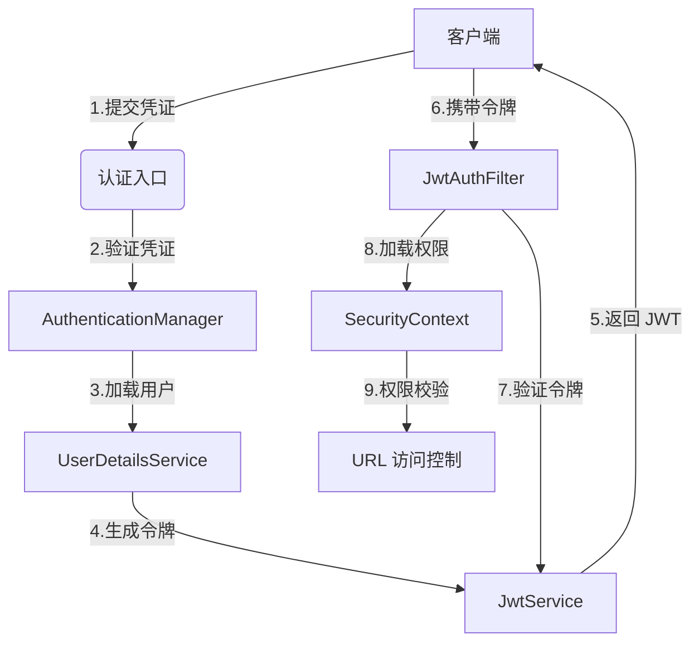

# 基于 Spring Boot + Security + JWT + Redis 的入门级认证授权模板

本项目是针对安全认证（Authentication）与授权（Authorization）场景的模板工程，基于 Spring Security 安全框架，结合 JWT 令牌与 Redis 缓存，提供注册、登录功能及权限控制的解决方案，便于初学者入门实践。

## 架构设计

项目采用 **MVC 分层架构**

- 控制层（`controller`）采用三泛型设计（实体类型 `T` + 主键类型 `ID` + 服务类 `S`），负责处理 HTTP 请求与响应，便于接口测试
- 服务层（`service`）采用三泛型设计（实体类型 `T` + 主键类型 `ID` + 映射器 `M`），接口与实现分离，服务实现类继承通用基类
- 持久层（`mapper`）采用双泛型设计（实体类型 `T` + 主键类型 `ID`），映射接口继承通用基接口，基于原生 MyBatis 实现 SQL 映射（暂不考虑 MyBatis-Plus）

## 访问控制模型

项目采用 **基于角色的访问控制（RBAC）** 模型，通过五表结构实现“用户-角色-权限”三级关系：用户表（`user`）、角色表（`role`）、权限表（`permission`）、用户角色关联表（`user_role`）、角色权限关联表（`role_permission`）。

角色和权限以字符串形式表达，**角色（Role）**通常以 `ROLE_` 前缀开头（如  `ROLE_ADMIN`），本质上是一组权限的集合。而**权限（Permission）**描述更细粒度的权限（具体操作或资源访问）。

## 认证授权流程

认证与授权流程构建在 **Spring Security 过滤器链机制**上。用户通过认证接口提交凭证（用户名、密码），认证成功后服务端生成并返回 JWT 令牌，客户端存储该令牌，并在后续请求中携带，交由服务端鉴权。

Spring Security 常见接口

- `UserDetailsService`：加载用户信息
- `UserDetails`：封装用户基本信息与权限
- `GrantedAuthority`：代表用户的权限项
- `Authentication`：封装认证请求或认证结果
- `AuthenticationManager`：执行认证流程的核心
- `SecurityContext`：存储当前用户的认证信息

### 用户认证

1. **客户端**（如浏览器）提交用户名和密码到登录接口（如 `/login`）
2. **安全配置类**  `SecurityConfig ` 拦截请求并判断是否放行
3. **认证管理器**  `AuthenticationManager` 接管认证流程
   - 使用 `BCryptPasswordEncoder` 验证密码（BCrypt 加密）
   - 调用 `UserDetailsServiceImpl` 加载用户详情（自行实现）
     1. 优先检查 Redis 缓存
     2. 缓存未命中则查询数据库
     3. 验证用户状态（业务逻辑）
     4. 查询关联权限（RBAC 模型）并加载（ `GrantedAuthority`）
     5. 封装用户信息与权限（实现 `UserDetails`）并返回

### 令牌生成

1. 从认证信息 `Authentication` 中获取用户详情 `UserDetails`
2. 构建 JWT 令牌，由三部分组成，用点号 `.` 分隔
   - 头部（Header）：元数据（算法、类型等）
   - 负载（Payload）：包含若干声明（Claims），携带实际数据项（用户信息、权限等）
   - 签名（Signature）：用于验证数据完整性

> JWT = Header + [Payload = { Claim1, Claim2, ... }] + Signature

### 请求鉴权

1. 客户端收到令牌并存储
2. 客户端在后续请求头中携带令牌（Bearer Token）
3. 自定义 JWT 过滤器 `JwtAuthFilter` 解析令牌并验证
4. 合法则存储至安全上下文 `SecurityContext`（底层基于 `ThreadLocal`），Spring Security 据此校验权限

## 缓存策略

项目采用 **三级缓存策略**，基于 Redis 缓存

- 用户 ID 映射（缓存键 `user:id:<username>`）对应属性 `id`
- 用户业务数据（键前缀 `user:data:<id>`）对应实体类 `User`
- 用户认证信息（键前缀 `user:auth:<id>`）对应封装类 `UserPrincipal`

## 启动流程

1. **数据源配置**
   - 编辑 `application.properties` 文件，配置数据源参数
   - 执行 `rbac.sql` 脚本，初始化数据库表结构
2. **注入配置**：按需调整 `common.config` 中涉及认证授权的配置
3. **项目启动**：运行 `Application.java` 主类，启动 Spring Boot 应用
4. **接口测试**：发起请求调用控制层接口，执行增删改查操作（`<RBAC>Controller.java`）或认证操作（`AuthController.java`）

## 相关脚本

脚本位于 `scripts/` 目录

- 数据表结构定义脚本：`rbac.sql` 
- 随机用户数据生成脚本：`generate_mock_user.py`
